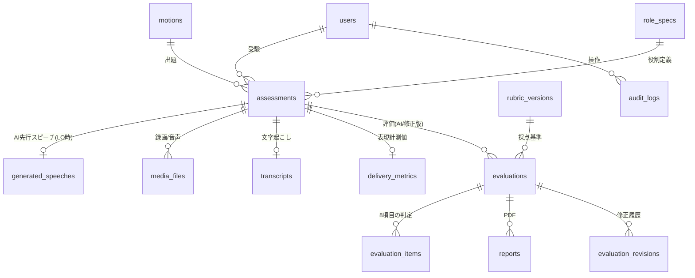

# 2. データベース設計

PostgreSQL 16 / Prisma によるスキーマ管理（マイグレーション履歴を必ずリポジトリに保存）。

## 2.1 ER 図（概要）

## 2.2 テーブル定義

### users — 利用者（受験者・管理者）

| カラム | 型 | 説明 |
|--------|----|------|
| id | uuid PK | |
| name | text | レポートに印字する氏名 |
| email | citext UNIQUE | ログインID |
| password_hash | text | |
| role | enum(`examinee`,`admin`) | |
| ui_language | enum(`ja`,`en`) default `ja` | |
| created_at / updated_at | timestamptz | |

※ 生年月日・受験者ID・本人確認情報は**持たない**（アセスメント版のため）。

### motions — 論題マスタ

| カラム | 型 | 説明 |
|--------|----|------|
| id | uuid PK | |
| text_en | text | 論題（英語） |
| text_ja | text NULL | 論題（日本語、第2フェーズ） |
| category | text NULL | 例: 教育 / 環境 / 社会 |
| difficulty | int NULL | 1〜5 |
| target_roles | text[] | 出題対象（既定: PM, LO） |
| is_active | boolean | 出題プールに含めるか |
| created_by | uuid FK→users | |
| created_at / updated_at | timestamptz | |

### role_specs — 役割定義（データ駆動）

| カラム | 型 | 説明 |
|--------|----|------|
| id | uuid PK | |
| role | enum(`PM`,`LO`,`MG`,`MO`,`LOR`,`PMR`) UNIQUE | |
| side | enum(`government`,`opposition`) | |
| speech_type | enum(`constructive`,`reply`) | ルーブリックの時間閾値・［ ］表記の切替に使用 |
| time_limits | jsonb | `{regulation, graceMax, minHalf, aMin}`（秒） |
| required_elements | jsonb | スピーチシート由来の必須要素（01-architecture 参照） |
| inputs | jsonb | 先行スピーチ要求（LO→`["pm_speech"]`） |
| is_enabled | boolean | MVP: PM, LO のみ true |

### assessments — 受験セッション

| カラム | 型 | 説明 |
|--------|----|------|
| id | uuid PK | |
| user_id | uuid FK→users | |
| role | enum(役割) | MVP: `PM` / `LO` |
| motion_id | uuid FK→motions | |
| language | enum(`en`,`ja`) default `en` | ディベート言語 |
| status | enum | `created`→`preparing`→`listening`(LOのみ)→`recording`→`uploaded`→`processing`→`scored` / `failed` / `abandoned` |
| status_detail | jsonb | パイプラインの進捗（ジョブ別状態・エラー） |
| prep_started_at / recording_started_at / recording_ended_at | timestamptz | |
| source | enum(`web`,`zoom`,`teams`,`meet`) default `web` | 録画ソース |
| settings_snapshot | jsonb | 受験時点の設定（録画保存ON/OFF等）を凍結保存 |
| created_at / completed_at | timestamptz | |

### generated_speeches — AI生成の先行スピーチ（LO受験時のPMスピーチ）

| カラム | 型 | 説明 |
|--------|----|------|
| id | uuid PK | |
| assessment_id | uuid FK UNIQUE | |
| role | enum | `PM`（将来: MG受験時のLO等） |
| script | text | 生成スクリプト全文（**永続保存**＝採点の前提条件として監査対象） |
| structure | jsonb | `{gov_point_1, gov_point_2, gov_point_1_detail, ...}` |
| llm_model / prompt_version | text | 再現性のため記録 |
| audio_storage_key | text NULL | TTS音声。cleanup 対象（script は残す） |
| duration_sec | numeric | |

### media_files — 録画・音声（一時保存）

| カラム | 型 | 説明 |
|--------|----|------|
| id | uuid PK | |
| assessment_id | uuid FK | |
| kind | enum(`video`,`audio_extracted`,`tts_audio`) | |
| storage_key | text | S3キー |
| size_bytes / mime_type / duration_sec | | |
| retention | enum(`delete_after_scoring`,`keep`) | 受験時の管理者設定を反映 |
| deleted_at | timestamptz NULL | 削除完了の証跡 |

### transcripts — 文字起こし

| カラム | 型 | 説明 |
|--------|----|------|
| id | uuid PK, assessment_id FK UNIQUE | |
| text | text | 全文 |
| words | jsonb | `[{w, start, end, conf}]` 単語タイムスタンプ |
| stt_provider / stt_model | text | |
| language | text | |

### delivery_metrics — 表現（Manner）の決定的計測値

| カラム | 型 | 説明 |
|--------|----|------|
| id | uuid PK, assessment_id FK UNIQUE | |
| speech_duration_sec | numeric | 発話終了−開始（Time Management 判定の一次情報） |
| silence_ratio | numeric | 沈黙時間/録画時間（態度・話す姿勢） |
| longest_silence_sec | numeric | |
| words_per_minute | numeric | |
| loudness_stats | jsonb | 平均/分散/レンジ（明瞭性の補助） |
| pitch_stats | jsonb | 抑揚（S判定の補助） |
| eye_contact_ratio | numeric | カメラ目線フレーム率（Vision判定） |
| frame_findings | jsonb | フレーム別の視線/姿勢/ジェスチャー判定＋タイムスタンプ |
| frames_analyzed | int | |

### rubric_versions — ルーブリック定義（バージョン管理）

| カラム | 型 | 説明 |
|--------|----|------|
| id | uuid PK | |
| version | text UNIQUE | 例: `2020-07-10.v1` |
| definition | jsonb | Excelルーブリックの機械可読表現（04-scoring 参照） |
| judge_prompt_version | text | 対応する判定プロンプト |
| is_active | boolean | |
| created_at | timestamptz | |

### evaluations — 評価（AI初回 + 管理者修正版を世代管理）

| カラム | 型 | 説明 |
|--------|----|------|
| id | uuid PK | |
| assessment_id | uuid FK | |
| rubric_version_id | uuid FK | |
| source | enum(`ai`,`admin_edit`) | |
| supersedes_id | uuid FK→evaluations NULL | 修正元（最新判定は `is_current`） |
| is_current | boolean | アセスメントごとに1件のみ true |
| matter_score | int 0–10 | RubricEngine 算出 |
| manner_score | int 0–10 | |
| total_score | int 0–20 | |
| matter_grade / manner_grade | enum(`S`,`A`,`B`,`C`) | 細目表記（0–2=C, 3–5=B, 6=A, 7–10=S） |
| pd_level | text | PD Level（換算マスタから算出） |
| good_points / improvement_points / overall_comments | text | 150〜200字（日本語） |
| llm_model / prompt_version | text | |
| created_by | uuid FK→users NULL | admin_edit の場合の編集者 |
| created_at | timestamptz | |

### evaluation_items — 8評価項目の判定詳細（判定根拠の保存先）

| カラム | 型 | 説明 |
|--------|----|------|
| id | uuid PK | |
| evaluation_id | uuid FK | |
| category | enum(`matter`,`manner`) | |
| item_key | enum | `reasoning` / `example` / `relevancy` / `role_strategy` / `attitude` / `eye_contact_gesture` / `clarity` / `time_management` |
| grade | enum(`S`,`A`,`B`,`C`) | 項目別表示グレード |
| criteria_results | jsonb | 詳細項目ごとの `{criterionId, met: bool, rationale, evidence:[{quote, startSec}] , source: "llm"\|"metric"}` |
| rationale | text | 項目全体の判定根拠（管理者画面・監査用） |

### evaluation_revisions — 管理者修正の監査ログ

| カラム | 型 | 説明 |
|--------|----|------|
| id | uuid PK | |
| evaluation_id | uuid FK | 修正後の evaluation |
| editor_id | uuid FK→users | |
| diff | jsonb | 変更前後（項目grade・criteria・コメント等） |
| reason | text | 修正理由（必須入力） |
| created_at | timestamptz | |

### reports — PD Assessment Report (PDF)

| カラム | 型 | 説明 |
|--------|----|------|
| id | uuid PK | |
| assessment_id / evaluation_id | uuid FK | どの評価世代のPDFかを固定 |
| storage_key | text | |
| issued_at | timestamptz | 再発行ごとに新規行 |
| issued_by | uuid FK NULL | NULL=自動発行、値あり=管理者再発行 |

### settings — システム設定（管理者画面から変更）

| カラム | 型 | 説明 |
|--------|----|------|
| key | text PK | 例: `recording.retention`（`delete`/`keep`）, `pd_level.mapping`, `daily_attempt_limit`, `judge.model` |
| value | jsonb | |
| updated_by / updated_at | | |

### audit_logs — 監査ログ

| カラム | 型 | 説明 |
|--------|----|------|
| id | bigserial PK | |
| actor_id | uuid FK→users | |
| action | text | `evaluation.edit` / `settings.update` / `report.reissue` / `motion.create` ... |
| target_type / target_id | text / uuid | |
| payload | jsonb | |
| created_at | timestamptz | |

### ジョブキュー

pg-boss が管理するテーブル（`pgboss.*` スキーマ）を使用。アプリ側では `assessments.status_detail` に
ジョブ進捗のスナップショットを保持し、SSE で受験者画面へ進捗配信します。

## 2.3 データ保持ポリシー

| データ | 保持 |
|--------|------|
| 録画・抽出音声・TTS音声 | 採点完了後に削除（既定）。設定 `recording.retention=keep` で保持 |
| 文字起こし・計測値・フレーム判定結果 | 永続（評価根拠のため） |
| 生成PMスピーチのスクリプト | 永続（採点の前提として監査対象） |
| 評価・判定根拠・修正履歴 | 永続 |
| PDF | 永続（再発行はいつでも可能） |
