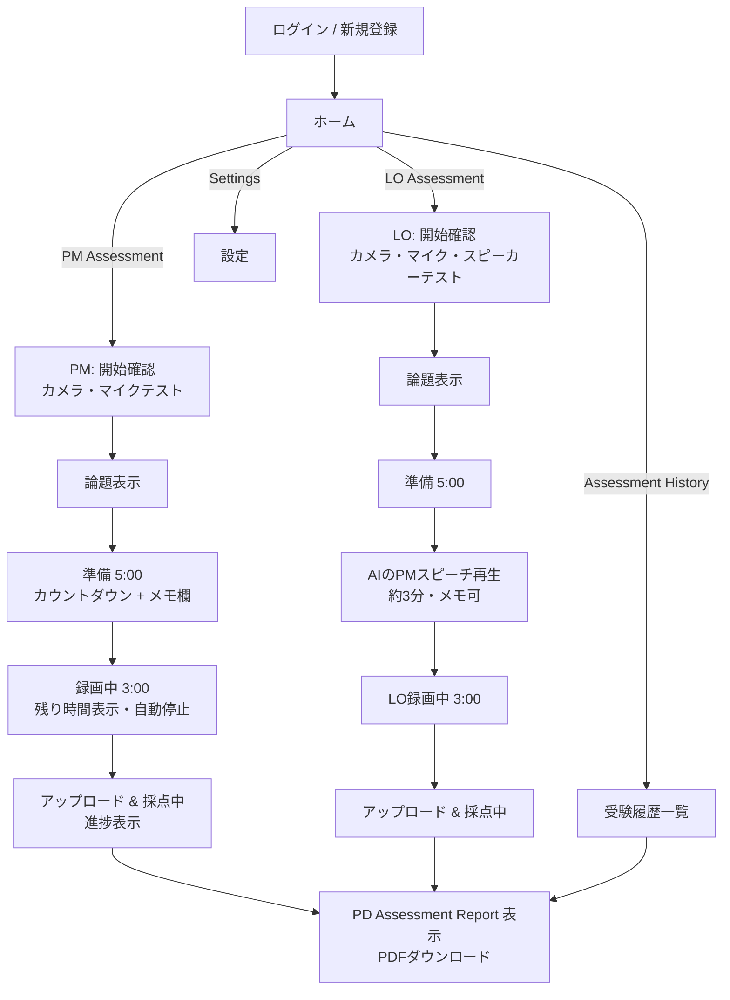
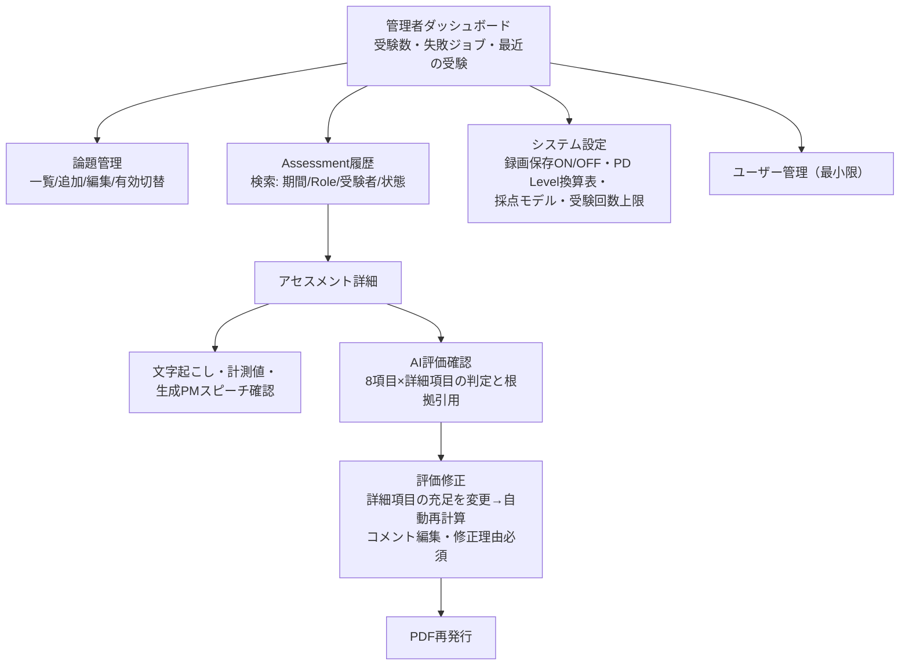

# 3. 画面遷移図・画面設計

設計方針：**高校生が説明なしで受験を完了できる**こと。1画面1目的、次にやることが常に1つだけ見える構成。

## 3.1 受験者側 画面遷移図

## 3.2 各画面の要点

### ホーム
- 4つの大きなボタンのみ：**PM Assessment / LO Assessment / Assessment History / Settings**
- 各ボタンに一言説明（例:「PM＝肯定側の最初のスピーチに挑戦」）。

### 開始確認（機材テスト）
- カメラ映像プレビュー・マイクレベルメーター・（LOのみ）テスト音再生。
- 「受験の流れ」を図で表示（準備5分 → [LO: PMスピーチ視聴 →] スピーチ3分 → 採点約N分）。
- 録画の扱い（採点後に削除される旨、設定により保存される場合はその旨）を明示して同意を得る。

### 論題表示 → 準備（5:00）
- 論題を大きく表示。準備開始ボタン押下でカウントダウン開始。
- 画面内メモ欄（スピーチシートの構成にあわせた枠：PM=定義/Point1/Point2/Point1詳細、LO=反論/Point1/Point2/Point1詳細）。
  メモは端末内のみで採点には使用しない旨を表示。
- 残り30秒で色が変わり、0秒で次ステップへ自動遷移（早めに進むボタンあり）。

### （LOのみ）PMスピーチ再生
- AI生成のPMスピーチ音声を再生（一時停止・再生のみ、早送り不可）。スクリプトは表示しない（聴解も含めて実戦形式）。
- 再生完了後「LOスピーチを開始」ボタンが有効化。

### 録画（3:00）
- 大きな残り時間・録画中インジケータ・自分の映像（小窓）。
- 規定3:00で合図、猶予上限 **3:35** で自動停止（ルーブリックの許容範囲 3:30 の判定を可能にするため）。
- 1:30 と 2:30 に小さな経過マーク（タイムマネジメント閾値の可視化）。
- 途中中断＝ `abandoned`（履歴に残るが採点しない）。

### 採点中
- パイプライン進捗（文字起こし中 → 採点中 → レポート作成中）をSSEで表示。想定 2〜4分。
- 完了で自動的にレポートへ遷移。失敗時は「もう一度受験」動線と管理者への自動通知。

### PD Assessment Report（画面 + PDF）
- 表示項目：Name / Test Date / Motion / Role / **Matter** / **Manner** / Total Score / **PD Level** /
  8評価項目の S/A/B/C / Good Points / Improvement Points / Overall Comments。
- 証明書サンプル（Mihon2）のレイアウトを踏襲しつつ、名称は **PD Assessment Report**、
  認定番号・生年月日・Official 表記は載せない。「本レポートは学習用アセスメントであり検定合格を証明しない」旨を明記。
- PDFダウンロードボタン。

### Assessment History
- 過去の受験一覧（日付・Role・Motion・Total・PD Level）→ タップでレポート再表示・PDF再取得。
- スコア推移のシンプルなグラフ（第2フェーズ）。

### Settings（受験者）
- 氏名（レポート印字名）、パスワード変更、UI言語。

## 3.3 管理者側 画面遷移図

### 評価修正画面（本システムの品質担保の要）
- 左：文字起こし（タイムスタンプ付き、根拠引用をハイライト）。右：8項目の判定ツリー。
- 管理者は**詳細項目（criterion）の充足 true/false を変更**する。点数・グレード・PD Level は
  RubricEngine が即時再計算（手入力の点数改変は不可＝ルーブリック整合性を構造的に保証）。
- コメント3種は直接編集可。保存時に修正理由必須 → `evaluation_revisions` に記録 → 新しい evaluation 世代を作成。
- 「この評価でPDFを再発行」ボタン。

## 3.4 UI ガイドライン

- 日本語UI（英語は第2フェーズ）。専門用語には短い注釈（例: Motion＝論題）。
- スマートフォンでも受験可能なレスポンシブ（録画はスマホカメラ対応）。ただし推奨はPC。
- 色だけに依存しない状態表示（アクセシビリティ、WCAG AA 目標）。
- 進行中の誤操作防止：録画中のページ離脱警告、二重受験の防止。
